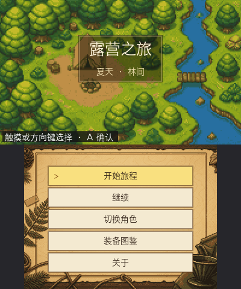
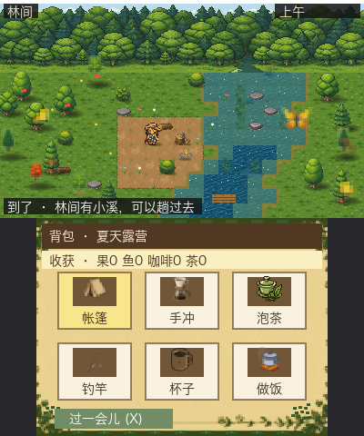
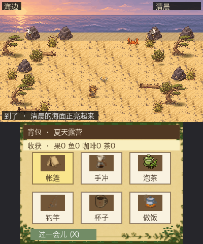
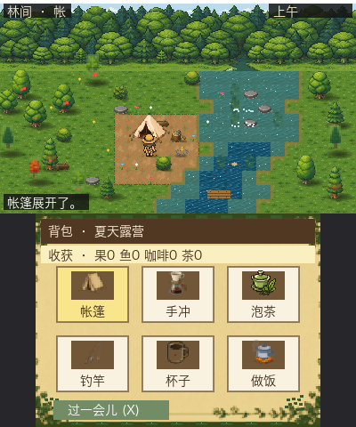
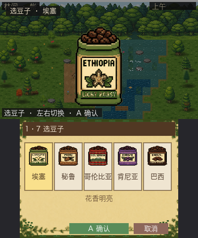
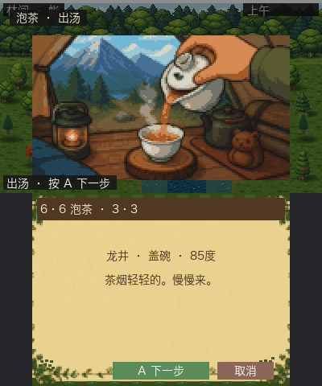
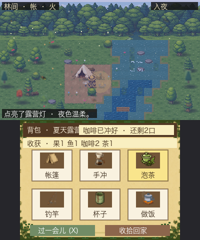
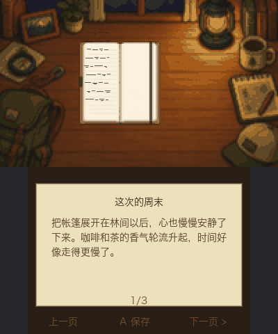

# 露营之旅 / Camping Trip

Nintendo 3DS 上的休闲露营游戏。爱好向，不上架，也和任天堂没有任何官方关系。

一个夏天，上班族把周末逃进林间或海边：搭帐篷、手冲咖啡、泡一壶茶、在水边钓鱼，看天色从清晨走到夜里，点起营火，第二天再收拾回家。下一周还可以再来。

## 在 Mac 上启动

先安装 [LÖVE 11](https://love2d.org/)（Homebrew）：

```bash
brew install --cask love
```

然后在仓库根目录打开游戏：

```bash
cd /Users/ruska/projects/3ds/linjian
love game
```

会弹出一个 400×480 的窗口，上屏和下屏叠在一起。方向键或 WASD 走路，鼠标点下屏背包，A / 回车确认，B / Esc 返回。若 macOS 提示无法验证，到系统设置 → 隐私与安全性 → 仍要打开。

从 GitHub 克隆的人也一样：

```bash
git clone https://github.com/jqlong17/camping-trip.git
cd camping-trip
love game
```

## 画面

桌面预览是上下叠屏，和真机双屏对应。

| 标题 | 林间营地 |
|:---:|:---:|
|  |  |
| **海边清晨** | **搭好帐篷** |
|  |  |
| **手冲选豆** | **泡茶出汤** |
|  |  |
| **夜里点灯** | **周末日记** |
|  |  |

**这是一个刚开源的小营地。** 缺一起搭帐篷的人：写代码、画像素、补目的地、在更多真机上试玩，都算共建。如果你也喜欢 3DS 和安静的周末，欢迎直接开 Issue 或 Pull Request，细节见 [CONTRIBUTING.md](./CONTRIBUTING.md)。

- 玩家名称：**露营之旅** / **Camping Trip**
- 引擎：[LÖVE Potion](https://github.com/lovebrew/lovepotion) 3.0.2（LÖVE 11）
- 上屏 400×240，下屏 320×240
- 许可证：[MIT](./LICENSE)

## 安装前请确认

游戏只跑在**已经安装自制固件**的 3DS / 2DS 上，不能装进原装系统。

你需要：

1. 已有 **Luma3DS** + **boot9strap**（或同等 CFW）
2. 能打开 **Homebrew Launcher**
3. 若走主画面图标，还需要 **FBI**
4. 音频需要 `sd:/3ds/dspfirm.cdc`。没有的话，进 Rosalina 菜单选 Dump DSP firmware，或先装一次 DSP1

请从本仓库的 [Releases](https://github.com/jqlong17/camping-trip/releases) 下载，不要把安装包塞进错误目录。

## 推荐：Homebrew 安装（.3dsx）

这是目前最稳的玩法，也是开发时日常使用的路径。

1. 在 [Releases](https://github.com/jqlong17/camping-trip/releases/latest) 下载 `CampingTrip-3dsx.zip`
2. 解压后，整份文件夹拷到 SD 卡：

```text
sd:/3ds/CampingTrip/
  CampingTrip.3dsx
  game/
```

3. **不要**把 `CampingTrip.cia` 放进这个文件夹。CIA 和大于 8MB 的安装包会让 Homebrew 菜单扫目录时崩掉，第二次再进就可能 data abort。
4. 安全弹出 SD，插回关机状态的 3DS，开机。
5. 打开 Homebrew Launcher，选择 **CampingTrip**。

如果主画面没有 Homebrew 图标：先真正打开「下载通信 / ダウンロードプレイ」，按 `L + ↓ + Select` 打开 Rosalina → Miscellaneous → **Switch the hb. title**，再重新打开下载通信。

## 也可以：FBI 安装 CIA（主画面图标）

想在主画面看到 **Camping Trip** 图标时，用这个。

LovePotion **官方不保证 CIA**。这个安装包是爱好向自打的，Title ID 为 `000400000F4C4A00`，按 Old 3DS 兼容设置打包，New 3DS 也可以装。大多数机器可以正常进游戏；如果装完主画面异常，按文末的卸载步骤处理。

1. 在 [Releases](https://github.com/jqlong17/camping-trip/releases/latest) 下载 `CampingTrip.cia`
2. 拷到 SD 卡的 **`cias/`**（或你习惯给 FBI 用的目录），例如：

```text
sd:/cias/CampingTrip.cia
```

3. 再次确认：它**不在** `sd:/3ds/CampingTrip/` 里面。
4. 安全弹出 SD，插卡开机，打开 **FBI**。
5. 进入 SD → `cias` → `CampingTrip.cia` → **Install CIA**。
6. 装完后**完全关机再开机**。主画面缓存有时不会立刻刷新，只按 Home 键往往看不到新图标。
7. 主画面里点 **Camping Trip**。

若你以前装过旧实验包 `00040000004C4A00`，先在系统设置或 GodMode9 里卸掉旧 Title，再装这一份。

### 装 CIA 后主画面黑屏怎么办

先不要重装系统。用 GodMode9（开机按住 START）：

1. HOME → Title manager
2. `[A:] SYSNAND SD`
3. 找到 Title `000400000F4C4A00`（或旧的 `00040000004C4A00`）
4. Manage title → Uninstall title
5. 再完全关机开机

日常开发、热更新请继续用上面的 `.3dsx` 路径。

## 怎么玩

```text
标题 → 序章 → 选角色（仅首次）→ 选目的地 → 出发 → 营地 → 回家写日记 → 标题
```

营地里：

| 操作 | 作用 |
|------|------|
| 方向键 | 四向走动 |
| 下屏点装备 | 直接使用 |
| 平地上按 A | 展开 / 收起帐篷 |
| 手冲 / 泡茶 / 做饭 / 钓竿 | 完整仪式，不是一句提示 |
| 入夜后走到篝火旁按 A | 点灯 |
| Y | 点过灯后收拾回家 |

更完整的操作表在 [docs/怎么玩.md](./docs/怎么玩.md)。

## 电脑上自测

改完玩法或美术后：

```bash
love game --playtest
LINJIAN_PLAYTEST_DESTINATION=forest love game --playtest
```

## 欢迎一起来开发

露营之旅还很小。林间和海边只是两个周末，手冲、泡茶、做饭、钓鱼也还可以更丰盛。我们希望它慢慢变成一个**大家一起养的营地**，而不是一个人关起门来做完。

特别缺这样的帮助：

- 新目的地、新道具、新的周末小事
- 16-bit 像素角色、分镜、道具
- 文案、日记句子、翻译
- 更多 3DS / 2DS 真机上的安装和帧率反馈
- 把文档写得对新人更友好

请读 [CONTRIBUTING.md](./CONTRIBUTING.md) 后直接开 Issue 或 PR。想法不成熟也可以先开讨论。哪怕只是来玩一周末、留下一句「这顶帐篷我想换个颜色」，都有用。

## 文档

| 文档 | 说明 |
|------|------|
| [CONTRIBUTING.md](./CONTRIBUTING.md) | 怎么参与 |
| [docs/怎么玩.md](./docs/怎么玩.md) | 操作与自测 |
| [docs/游戏设计-SPEC.md](./docs/游戏设计-SPEC.md) | 体验规格和 DEV 日志 |
| [docs/动画与交互-SPEC.md](./docs/动画与交互-SPEC.md) | 四向精灵和仪式 |
| [docs/3DS真机开发踩坑与发布准则.md](./docs/3DS真机开发踩坑与发布准则.md) | 真机坑和发布边界 |

## 声明

- 这是爱好向自制游戏，**不是**任天堂官方软件，也没有上架 Nintendo eShop。
- 安装自制固件、FBI、CIA 都有风险，请在自己的机器上自行判断。
- LovePotion 官方支持的是 `.3dsx`；本仓库提供的 CIA 是社区打包，方便主画面启动，不保证每一台机器都和 Homebrew 路径一样稳。
