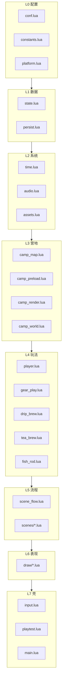
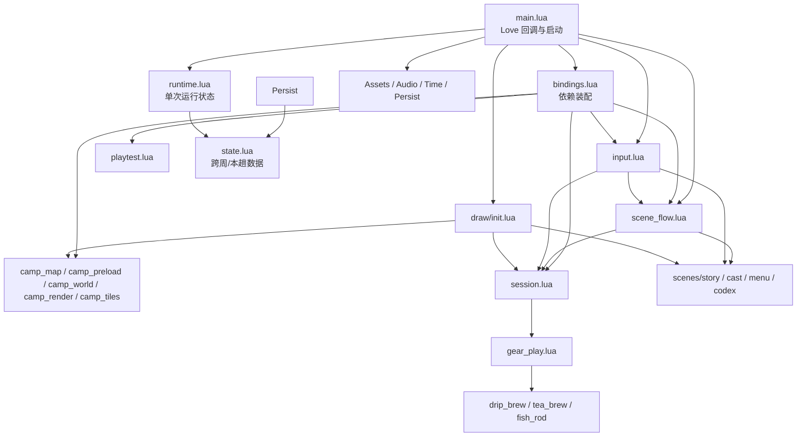

# 露营之旅 — 代码架构 SPEC（模块化）

> 从属：[游戏设计-SPEC.md](./游戏设计-SPEC.md) · [动画与交互-SPEC.md](./动画与交互-SPEC.md)  
> 状态：2026-08-31 · **P0–P8 已落地**（DEV-068a–f）
> 动机：真机/桌面 `main.lua` 触顶 **Lua 200 locals**；单文件 ~3700 行，玩法迭代风险高。
>
> **当前代码入口**：先读 [§14 技术快照](#14-技术快照2026-08-31-1347-utc8)。§1–§13 同时保留了迁移前问题、目标设计与实施计划；若与当前代码不一致，以 §14 和实际代码为准。

---

## 1. 问题陈述

### 1.1 触发事件

2026-08-31 在 `main.lua` 增加时间常量时，Love 编译报错：

```text
main function has more than 200 local variables
```

排查结论（桌面 `love game --playtest`）：

| 指标 | 当前值 | 上限 |
|------|--------|------|
| `main.lua` 顶层 `local` 名字 | **~198** | **200** |
| 其中 `local function` | 76 | — |
| 其中变量 / table / 常量 | ~122 | — |
| 顶层 `function`（全局，**不计入**） | 59 | — |
| 文件行数 | ~3700 | — |

Lua 限制来自编译器硬编码（`lparser.c` → `MAXVARS 200`），**每个函数/文件 chunk 独立计数**。整个 `.lua` 文件等价于一个 main chunk，顶层所有 `local` 共享配额。

参考：[Stack Overflow — Lua 200 local limit](https://stackoverflow.com/questions/66511018/lua-how-many-variables-a-local-can-hold)

### 1.2 结构性问题

| 现象 | 影响 |
|------|------|
| 状态散落成 80+ 顶层 scalar | 每加一个字段占 1 名额；难追踪谁改 `scene` |
| 76 个 `local function` 堆在 main chunk | 渲染/音频/流程/时钟耦合在一起 |
| 17 个 forward declare 占名额 | `local updateFish, spawnFishJump, ...` 一行即 7+ local |
| 仪式已模块化，其余仍 monolith | `drip_brew` / `tea_brew` / `fish_rod` 证明路径可行，但未推广 |

### 1.3 已有成功经验（必须复用）

[手冲模块-SPEC.md](./手冲模块-SPEC.md) 已验证的模式：

1. **独立 `require` 文件**，模块内自有 200 配额。  
2. **`Module.bind(host)`** 注入宿主能力，模块不闭包 `main` 的 local。  
3. **`PHASES` 数据驱动**，行为与表分离。  
4. **`main` 只保留**：入口、全局 `ritual` 指针、输入路由、playtest 钩子。

本架构 SPEC 将该模式推广到 **时钟 / 存档 / 音频 / 资源 / 营地 / 场景 / 输入**。

---

## 2. 目标与非目标

### 2.1 目标

1. **`main.lua` 顶层 local ≤ 30**，长期留 **≥ 50** 余量。  
2. **行为零回归**：整局流程、playtest、`verify-3ds-install.py` 全 PASS。  
3. **增量迁移**：每阶段可合并、可发 3dsx，禁止「停更两周大重构」。  
4. **新玩法默认加在模块里**，不再往 `main.lua` 堆 `local function`。  
5. 提供 **`scripts/count-lua-locals.py`**，CI/自测可预警 >180。

### 2.2 非目标

- 不重写 LovePotion 引擎层。  
- 不顺带改玩法数值、美术管线。  
- 不引入 luarocks / 第三方 OOP 框架。  
- 不把 `love.*` 回调拆到多个文件注册（仍只在 `main.lua` 暴露给引擎）。

---

## 3. 设计原则

### 3.1 分层依赖（单向）



**规则**

- 下层 **不得** `require` 上层（例如 `time.lua` 不能 require `draw/play.lua`）。  
- 同层模块通过 **`state.lua` 只读/显式 API** 通信，禁止跨模块写私有 upvalue。  
- 仪式模块（drip/tea/fish）保持 **bind 宿主**，不改为直接读全局 `_G`。

### 3.2 状态：一个权威 `State` 表

避免再增加顶层 scalar。运行时权威状态收进 **单例 table**（模块 `state.lua` 返回）：

```lua
-- state.lua（示意）
local S = {
  scene = "title",
  build = { id = "..." },
  platform = { isConsole = false, staticPlayFx = false },
  trip = { haul = {...}, fruitTrees = {} },
  player = { x = 10, y = 9, facing = 0, castId = 1 },
  time = { dayIndex = 1, clockMin = 540, frozen = false, autoT = 0 },
  camp = { ready = false, map = {}, decals = {} },
  ui = { toast = "", toastT = 0, menuIndex = 1 },
  play = { ritual = nil, lanternOn = false, tentOpen = false },
}
return S
```

访问约定：

| 场景 | 写法 |
|------|------|
| 模块内部 | `local S = require("state")` 然后 `S.time.clockMin` |
| 需重置整趟 | `State.resetTrip()` 等显式函数，不散落赋值 |
| 仪式 bind | host 提供 `getRitual` / `setRitual`，内部读写 `S.play.ritual` |

**注意**：`require("state")` 在 Lua 5.1 下缓存为同一 table，**不要** `return { ... }` 每次 copy。

### 3.3 宿主 `Host`：副作用出口

模块内禁止直接调用未注入的 `love.audio.play`。统一经 **Host**（由 `main.lua` 在 `love.load` 组装）：

| Host 能力 | 提供者 | 典型消费者 |
|-----------|--------|------------|
| `say(msg, sec)` | ui 薄封装 | 全部 |
| `playSfx` / `playBgm` / `syncAmbient` | audio.lua | gear, scenes, rituals |
| `loadImage` / `assetPath` | assets.lua | camp, draw, rituals |
| `appendLoadLog` | platform | assets, preload, playtest |
| `getRitual` / `setRitual` | state + gear_play | drip/tea/fish |

初始化顺序（固定）：

```lua
-- main.lua love.load 示意
local State = require("state")
local Host  = require("host")
Host.init({
  state = State,
  say = function(...) require("ui_toast").say(...) end,
  -- ...
})
require("audio").bindHost(Host)
require("assets").bindHost(Host)
require("time").bindHost(Host)
require("drip_brew").bindHost(Host)  -- 已有
```

### 3.4 全局符号策略

| 符号 | 策略 |
|------|------|
| `love.*` 回调 | **仅** `main.lua` 定义 `function love.load` 等 |
| `Persist.*` | 迁入 `persist.lua`；过渡期可保留 `_G.Persist = require("persist")` 供 playtest 字符串断言 |
| `DripBrew` / `TeaBrew` / `FishRod` | 保持 `require` 挂 `_G` 或 `main` 局部 **1 个**（与现网 playtest 兼容） |
| `drawTop` / `drawBottom` | 迁入 `draw/init.lua`，由 `love.draw` 调用 **1 个** `Draw.frame()` |
| 场景跳转 `goTitle` 等 | 收进 `scene_flow.lua` 导出表，禁止 20 个全局 `function goX` |

### 3.5 局部变量预算

| 模块 | 目标 local 数 | 说明 |
|------|---------------|------|
| `main.lua` | ≤ 30 | 仅 require 别名 + love 回调 |
| 单系统模块 | ≤ 80 | 超过则再拆（如 `camp_render` → `camp_ground` + `camp_props`） |
| 单 draw 文件 | ≤ 60 | 按场景拆文件 |
| 仪式模块 | ≤ 100 | 已达标 |

预警线：**单文件 ≥ 180** 时 pre-commit / playtest 前必须报 WARN。

---

## 4. 模块目录（目标态）

```
game/
  conf.lua                 # Love 启动配置（保持）
  main.lua                 # 引擎壳 ~150 行
  host.lua                 # Host 组装 + bind 注册
  constants.lua            # 分辨率、TILE、时段名、gear 静态表
  platform.lua             # isConsole、feature flags、load log
  state.lua                # 权威运行时 State 单例
  persist.lua              # 存档 JSON（现 Persist 表）
  time.lua                 # 时钟、R 快进、自动 tick、光线档
  audio.lua                # BGM/SFX/环境音
  assets.lua               # 路径探测、loadImage、ensureStory/Cast/Ritual
  ui_toast.lua             # say / drawToast
  camp_map.lua             # buildMap、walkable、tile 工具、fruitTrees
  camp_preload.lua         # campPreload 步进器
  camp_world.lua           # 鱼/鸟/虫/夜星/溅水 update+spawn
  camp_render.lua          # 地面/水/树/玩家/世界 FX 绘制入口
  player.lua               # tryMove、drawPlayerAt
  gear_play.lua            # tryUseGear、帐篷/扇/杯/非仪式装备
  scene_flow.lua           # goTitle/goPlay/... 场景状态机
  input.lua                # keypressed/gamepad/touch 路由
  playtest.lua             # --playtest 状态机
  drip_brew.lua            # 已有
  tea_brew.lua             # 已有
  fish_rod.lua             # 已有
  scenes/
    title.lua              # 菜单逻辑 + 可选 draw 委托
    story.lua              # prologue/depart/homecoming beats
    cast.lua
    codex.lua
    about.lua
    diary.lua
    play.lua               # play 场景 update 切片（非 love.update 全部）
  draw/
    init.lua               # drawTop/drawBottom 分发
    title.lua
    story.lua
    cast.lua
    codex.lua
    about.lua
    diary.lua
    play_top.lua
    play_bottom.lua
    camp_tiles.lua         # drawGround、drawCampGroundLayer
    ritual_overlay.lua
```

**3DS 部署**：上述 `.lua` 与 PNG 一样随 `game/` 进 RomFS；`require` 路径不含 `.lua` 后缀，与现网一致。

---

## 5. 模块职责详表

### 5.1 `main.lua`（引擎壳）

| 职责 | 说明 |
|------|------|
| `love.load` | 调 `Host.init` → `Persist.load` → 字体 → 标题资源 → playtest 探测 |
| `love.update` | 委托 `SceneFlow.update(dt)`、`Time.tickAuto(dt)`、`CampWorld.update(dt)`、`Playtest.tick(dt)` |
| `love.draw` | `Draw.frame(screen)` |
| `love.keypressed` 等 | `Input.onKey(...)` |
| **禁止** | 业务 `if phase ==`、大地图绘制、存档字段拼装 |

### 5.2 `state.lua`

- 持有 §3.2 全部可变字段。  
- 导出：`resetTrip()`、`resetCampSession()`、`snapshotForSave()`。  
- **不**含 love 调用。

### 5.3 `persist.lua`

- 从现 `Persist.*` 原样迁移。  
- 依赖：`state.trip`、`state.saveData`（或 bind 读 host.state）。  
- 文件：`save.json` 路径不变。

### 5.4 `time.lua`

| API | 说明 |
|-----|------|
| `Time.bindHost(h)` | 注入 `say`、`appendLoadLog`、`syncPlayBgm` |
| `Time.label()` | `D1 09:00` |
| `Time.advance(reason)` | wait / auto / manual |
| `Time.fastForward()` | R 键：+10 分，不跨天 |
| `Time.tickAuto(dt)` | play 场景自动走时 |
| `Time.setClock(min, day?)` | playtest / 调试 |
| `Time.tint()` | 返回当前 `timeTint` 行 |
| `Time.isNight()` | 夜星/虫触发 |

**状态归属**：`S.time.*` 全部字段。

### 5.5 `audio.lua`

- 真机策略见 **[真机音频扩展-SPEC.md](./真机音频扩展-SPEC.md)**（DEV-069）：由 `console_single_stream_no_stop` 升级为 `console_prox_amb_bgm_switch`（title/night BGM + 近水溪水 + 近鸟 sfx）。  
- `playSfx` pcall 兼容真机无 `setPitch`。  
- `syncPlayBgm` / `syncAmbient` / **`syncSceneBgm`** 读 scene + `Time.isNight()`；鸟叫冷却建议收进 **`Audio.tick(dt)`**。

### 5.6 `assets.lua`

- `detectAssetRoot`、`mountFullPath`（DEV-048）、失败负缓存。  
- `ensureStory/Cast/Walk/Ritual` 懒加载。  
- `loadImage` → 真机 `.t3x` 逻辑集中在此，不散落 draw。

### 5.7 `camp_*` 三件套

| 文件 | 从 main 迁出 |
|------|----------------|
| `camp_map.lua` | `buildMap`、`walkable`、`tileAt`、`fruitTrees`、`firepit` |
| `camp_preload.lua` | `makeCampPreloadSteps`、`runCampPreloadSlice`、`ensureCamp` |
| `camp_world.lua` | fish/critter/night/splash update+spawn |
| `camp_render.lua` | `drawPlayTop` 编排；调用 `draw/camp_tiles` |

静态底图 `camp_static_base` 策略（DEV-055）不变；渲染模块只读 `State.platform.staticPlayFx`。

### 5.8 `gear_play.lua`

- `gear` 静态表可进 `constants.lua` 或留此文件。  
- `tryUseGear`、`toggleTent`、`drinkFromCup`、杯/壶状态。  
- 仪式入口：**只** `DripBrew.start()` / `TeaBrew.start()` / `FishRod.start()`，不在此写相位 if。

### 5.9 `scene_flow.lua`

- 场景 ID 与 [游戏设计-SPEC §3.0](./游戏设计-SPEC.md) 一致。  
- 导出：`goTitle()`、`goPlay()`、`startJourney()`、`confirmMenu()` …  
- 负责 **场景切换时** 的 BGM/预加载触发，不画像素。

### 5.10 `scenes/*.lua`

每个文件包：**进入条件、advance、输入子集（可选）**。  
例：`scenes/cast.lua` → `Cast.advance()`、`Cast.confirm()`、`Cast.hitTest()`。

### 5.11 `draw/*.lua`

- 纯绘制 + 读 State/assets；**不写** 存档、不改 scene。  
- `draw/init.lua`：

```lua
function Draw.frame(screen)
  if screen == "top" then Draw.routeTop() else Draw.routeBottom() end
end
```

### 5.12 `input.lua`

- 按 `State.scene` 分发；play 场景 ritual 进行时先交给对应 `DripBrew.onKey`（若未来需要）。  
- 桌面 WASD / 3DS gamepad 映射保持 [怎么玩.md](./怎么玩.md)。

### 5.13 `playtest.lua`

- 完整迁出 `playtestTick` 与 41 步状态机。  
- 通过 Host 调场景跳转，**禁止** 依赖 main 私有 local。  
- 继续写 `playtest/outDir/result.txt` → `PASS`。

---

## 6. 仪式模块与架构的关系

现有三模块 **不改对外 API**，仅改 bind 来源：

```lua
-- gear_play.lua
DripBrew.bindHost({
  say = Host.say,
  getRitual = function() return State.play.ritual end,
  setRitual = function(r) State.play.ritual = r end,
  -- ...
})
```

新增仪式（例：未来「搭帐篷仪式」）流程：

1. 写 `docs/xxx模块-SPEC.md`  
2. 新建 `game/xxx.lua` + `bindHost`  
3. 在 `gear_play.tryUseGear` 加 **1 个** 分支调用 `Xxx.start()`  
4. **禁止** 在 `main.lua` 加 local

---

## 7. 迁移计划（增量）

每阶段：**迁模块 → playtest PASS → audit locals → deploy 可选**。

| 阶段 | 内容 | 预估释放 main locals | 风险 |
|------|------|----------------------|------|
| **P0** | `scripts/count-lua-locals.py`；文档入 SPEC | 0 | 低 |
| **P1** | `persist.lua` + `time.lua` + `state.lua`（时间+存档字段） | ~25 | 低 |
| **P2** | `ui_toast.lua` + `audio.lua` | ~20 | 低 |
| **P3** | `playtest.lua` | ~15 | 中（步骤多） |
| **P4** | `assets.lua` + `camp_preload.lua` | ~25 | 中（真机路径） |
| **P5** | `camp_map.lua` + `camp_world.lua` | ~30 | 中 |
| **P6** | `draw/camp_*` + `camp_render.lua` | ~40 | 高（绘制回归） |
| **P7** | `scenes/*` + `scene_flow.lua` | ~25 | 中 |
| **P8** | `draw/*` 余下 + `input.lua`；main 收到 ~150 行 | ~20 | 中 |

**禁止**：跨阶段合并未验收的 PR；P6 与 P7 不可并行（draw 依赖 scene 路由稳定）。

### 7.1 P1 验收标准（样板阶段）

- `scripts/count-lua-locals.py game/main.lua` → **≤ 175**  
- `love game --playtest` → PASS  
- R 键仍为当天 +10 分（DEV-052 修订行为）  
- 真机 `load_report.txt` 无新 ERROR  

---

## 8. 工具与门禁

### 8.1 `scripts/count-lua-locals.py`

- 统计规则：与 Lua 5.1 一致，**顶层 chunk 的 local 名字总数**（含 `local function`）。  
- 输出：`OK` / `WARN`（≥180）/ `FAIL`（≥200）。  
- 接入：`love game --playtest` 前可选调用；`verify-3ds-install.py` 可增加 WARN 行。

### 8.2 模块新增 checklist

- [ ] 单文件 locals < 180  
- [ ] 不新增 main 顶层 local（除非 main 同时删等量）  
- [ ] 副作用走 Host  
- [ ] 状态写 State 子表  
- [ ] 更新本 SPEC 或子模块 SPEC  
- [ ] playtest 覆盖新路径或注明 N/A  

---

## 9. 测试策略

| 层级 | 命令 | 期望 |
|------|------|------|
| 桌面全流程 | `love game --playtest` | `PASS` |
| 静态营地 | `LINJIAN_PLAY_FX=static love game --playtest` | PASS |
| 局部变量 | `python3 scripts/count-lua-locals.py game/main.lua` | ≤175（P1 后） |
| 像素 | `scripts/audit-pixel-style.py` | 0 fail |
| 真机 | `scripts/verify-3ds-install.py` + 短玩 | 无 abort |

**不建议** 为每个模块引入独立 unit test 框架（Love 上过重）；`playtest` + 局部计数足够。

---

## 10. 反模式（禁止）

| 反模式 | 原因 | 替代 |
|--------|------|------|
| 去掉 `local` 变全局凑名额 | 污染、难测、真机偶发 nil | 拆文件 |
| `do ... end` 包一层以为能减 200 | Lua 5.1 同函数寄存器池仍共享 | 拆文件 |
| 模块间 `require` 循环 | 启动顺序不确定 | 依赖 state/host，单向 |
| 在 draw 里 `Persist.write()` | 绘制路径卡顿、难复现 | scene_flow / diary 场景 |
| 复制粘贴 forward declare 行 | 占 7+ local | 同文件内 local function 或 module table |
| 新功能直接写 main | 再次触顶 | 新模块 + SPEC |

---

## 11. 与现有文档关系

| 文档 | 关系 |
|------|------|
| [游戏设计-SPEC.md](./游戏设计-SPEC.md) | 玩法权威；架构 **不得** 改流程定义 |
| [手冲/泡茶/钓鱼模块-SPEC](./手冲模块-SPEC.md) | 仪式模块样板；bind 契约延续 |
| [动画与交互-SPEC.md](./动画与交互-SPEC.md) | draw 模块须遵守精灵/仪式绘制约定 |
| [怎么玩.md](./怎么玩.md) | 输入映射；`input.lua` 保持一致 |
| Skill `linjian-camping-3ds` | 迁移后更新「资源位置 / 自测」节 |

---

## 12. DEV 追踪

| ID | 日期 | 状态 | 摘要 |
|----|------|------|------|
| **DEV-068** | 2026-08-31 | **done** | **代码架构 SPEC**：main.lua 从约 3700 行收敛为 119 行引擎壳；6/200 locals |
| **DEV-068a** | 2026-08-31 | done | P0：`count-lua-locals.py` |
| **DEV-068b** | 2026-08-31 | done | P1：`state` + `time` + `persist`；main 173 locals |
| **DEV-068c** | 2026-08-31 | done | P2：`ui_toast.lua` + `audio.lua`（bindHost） |
| **P1–P3 接线** | 2026-08-31 | done | `state/persist/time/ui_toast/playtest` 接入 main；102 locals |
| **DEV-068e** | 2026-08-31 | done | P4–P6：`assets` + `camp_preload` + `camp_map` + `camp_world` + `draw/camp_tiles` + `camp_render`；main **115** locals；playtest PASS |
| DEV-069 | — | wip | 真机 title/night BGM + 近水溪 + 近鸟 sfx（单独立 SPEC） |
| **DEV-068f** | 2026-08-31 | done | P7–P8：`scene_flow` + `scenes/*` + `draw/*` + `input`；运行期状态与装配拆至 `runtime/session/bindings`；main **119 行 / 6 locals**；41 步 playtest PASS |

---

## 13. 开放问题（实施前可拍板）

1. **`State` 是否允许模块直接写字段？**  
   - 建议：允许读；写通过小函数 `State.setScene(id)` 便于断点/log。  
2. **`gear` 表放 `constants.lua` 还是 `gear_play.lua`？**  
   - 建议：静态放 constants，交互放 gear_play。  
3. **draw 是否再拆 `draw/play_top.lua` 为 top + hud？**  
   - 视 P6 后 local 计数而定，非必须。  
4. **是否引入轻量 `events.emit("dawn")`？**  
   - 非 P1 范围；时钟侧效应现保持 `say` + `canGoHome` 即可。

---

## 14. 技术快照（2026-08-31 13:47 UTC+8）

> **时间点声明**：本节记录的是 **2026-08-31 13:47（UTC+8）工作区代码现状**，对应
> `runtime.lua` 中 buildId `2026-08-31-dev071-p7-p8`。它是交接索引和诊断基线，
> **不是永久架构承诺，也不自动覆盖未来提交**。后续改动若改变模块边界、状态所有权、
> 启动顺序或验收方式，应新增下一份带时间的快照，不要静默改写本节所描述的历史状态。

### 14.1 快照摘要

| 指标 | 当前值 | 说明 |
|------|--------|------|
| 运行时代码 | `game/**/*.lua` 共 **5600 行** | 32 个 Lua 文件 |
| 引擎入口 | `game/main.lua` **119 行** | 只注册全局模块、组装依赖、实现 `love.*` 回调 |
| main chunk locals | **6 / 200** | Lua 5.1 locals 风险已解除 |
| 最大 Lua 文件 | `drip_brew.lua` **449 行** | 其次 `fish_rod.lua` 434、`tea_brew.lua` 419 |
| 场景主流程 | `title → prologue → cast(首次) → depart → play → homecoming → diary → title` | 已有角色时只跳过 cast |
| 自动验收 | 41 步 `love game --playtest` | 2026-08-31 本快照为 PASS |
| 本地 3DS 闸门 | `verify-3ds-install.py --skip-sd` | 本快照为 48/48 PASS |

### 14.2 当前真实拓扑

下面是**实际代码**的依赖关系，不是 §4 的历史目标目录：



依赖方向大体是：

```text
main / bindings
  → flow + input + draw
  → session + scenes + camp
  → gear + rituals + systems
  → state / runtime / asset paths
```

当前并非严格无环的“纯分层架构”，而是 **Lua 单例模块 + Host 注入 + 少量全局模块注册**
组成的实用型架构。模块之间没有已知 `require` 循环，但会通过 `_G` 中的
`State`、`Audio`、`Assets`、`CampMap` 等间接耦合。

### 14.3 状态所有权（当前现状）

当前状态不是 §3.2 所设想的单一 `State`，而是按生命周期分散在多个单例：

| 所有者 | 持有内容 | 生命周期 / 写入者 |
|--------|----------|-------------------|
| `state.lua` | `trip.haul`、果树余量、存档数据、菜单定义、角色定义 | 跨场景；`persist`、`scene_flow`、`session`、`gear_play` |
| `runtime.lua` | 当前 scene、玩家、装备选择、帐篷、杯壶、ritual、字体、平台 flags、性能计数 | 单次进程；`main`、`scene_flow`、`session`、`input` |
| `time.lua` 私有 upvalue | 天数、分钟、冻结状态、自动推进累计 | 单次营地；仅 `Time.*` API 修改 |
| `camp_map.lua` 私有 upvalue | 地图、decals、firepit、渲染索引 | 启动构建；CampMap API |
| `camp_world.lua` 私有 upvalue | 鱼、鸟虫、夜空、溅水特效 | 单次进程；CampWorld API |
| `assets.lua` 私有 upvalue | 资源根、失败缓存、已加载图片表 | 单次进程；Assets API |
| `audio.lua` 私有 upvalue | BGM/SFX/环境音 Source 与冷却 | 单次进程；Audio API |
| `scenes/story.lua` | 三组 beats 与当前索引 | 单次场景流程；Story/Flow |

因此，排查状态问题时不要只搜索 `State.*`；至少同时检查 `runtime.lua`、`time.lua`
以及对应 camp/system 模块的私有状态。

### 14.4 启动、帧循环与场景数据流

#### 启动链

```text
main.lua require 全局模块
  → require runtime/session/flow/input/draw/bindings
  → Bindings.bind()（在 love.load 之前）
  → love.load()
      → 写 boot 日志 / detectRoot
      → Persist.load()
      → CampMap.build() + indexRenderData()
      → Assets.loadBoot()
      → Audio.loadBgm/loadSfx（桌面）
      → 字体、星空、桌面下屏 Canvas
      → Flow.syncSceneBgm()
      → Playtest 开关
```

关键约束：`Bindings.bind()` 当前发生在模块加载期，依赖 `main.lua` 先把 17 个兼容模块
挂到全局；改变 require 顺序可能导致运行时 nil。

#### 每帧更新

```text
love.update(dt)
  → 性能窗口与 load_report
  → Audio.ensureConsoleLoaded()
  → titlePulse / waterPhase / Toast
  → brewTimer / potSimmer
  → scene == play:
      玩家 idle 帧
      CampWorld.update*（仅 !staticPlayFx）
      Audio.tick()
      Session.updateTimedRitual()
      Time.tickAuto()
  → Playtest.tick()
```

#### 输入

```text
love.keypressed/gamepadpressed/touchpressed/mousepressed
  → input.lua
  → 按 Runtime.scene 分发
  → scenes.menu/cast/codex（选择与 hit test）
  → scene_flow（场景转换）
  → session / gear_play（营地动作与仪式）
```

#### 绘制

```text
love.draw(screen)
  → draw/init.lua 路由 top / bottom
  → draw/menu.lua：title / codex / about
  → draw/story.lua：story / cast / diary / toast
  → draw/play.lua：玩家、世界附加物、仪式、背包下屏
  → camp_render.lua + draw/camp_tiles.lua：营地上屏
```

#### 存档

```text
Persist.load() → State.save.data → refreshMenu()
营地行为 → State.trip.haul
homecoming → diary → Flow.finishDiary()
  → Persist.commitTrip()
  → save.json
  → Flow.goTitle()
```

### 14.5 Host / bindings 机制

`bindings.lua` 是当前 composition root，负责四组注入：

1. **campHost**：统一给 `CampMap`、`CampPreload`、`CampWorld`、`CampTiles`、
   `CampRender` 注入尺寸、flags、资源、状态 getter 与绘制回调。
2. **系统 Host**：给 `Assets`、`Time`、`Audio` 注入平台、日志和跨系统回调。
3. **玩法 helpers**：给 `Session`、`Flow`、`Input`、`Cast` 注入 `say` 与按需资源加载；
   `Session.bindHost()` 再向下绑定 `GearPlay`，后者绑定三个仪式模块。
4. **playHost 代理**：通过 metatable 把 41 步 playtest 对字段的读写映射到
   `Runtime`、CampWorld 与 Flow/Session API。

新增模块时优先选择以下之一：

- 纯数据/纯函数：直接 `require`，不要 bind。
- 需要 Love、日志、音频、资源或跨模块写状态：在 `bindings.lua` 中注入最小 Host。
- 不要在业务模块中新建另一套全局 service locator。

### 14.6 代码索引

#### 引擎、状态与系统

| 文件 | 当前职责 | 主要入口 |
|------|----------|----------|
| `main.lua` | require、启动、帧循环、Love 回调 | `love.load/update/draw/*pressed` |
| `bindings.lua` | 所有 Host 组装、playtest 代理、统一日志 | `bind`、`appendLoadLog` |
| `runtime.lua` | 单次运行期状态、平台 flags、装备静态表 | `require("runtime")` 返回共享表 |
| `state.lua` | 存档/本趟/菜单/角色共享数据 | `resetTripHaul` |
| `persist.lua` | JSON 编解码、save.json、累计统计、菜单继续状态 | `load/write/commitTrip/resetTripHaul` |
| `time.lua` | 营地时钟、光线档、夜晚、R 快进、自动推进 | `resetForCamp/tickAuto/fastForward/setClock` |
| `audio.lua` | 桌面/3DS BGM、SFX、近水环境音、场景音频同步 | `load*`、`play*`、`sync*`、`tick` |
| `assets.lua` | 真机路径探测、PNG/T3X 加载、失败负缓存、懒加载 | `detectRoot/load/ensure*/loadBoot` |
| `asset_paths.lua` | 重组后资源路径和 9 种杯型定义 | `ui/story/gearPath/cupPath/...` |
| `ui_toast.lua` | 顶屏提示状态与绘制 | `say/clear/update/draw` |
| `conf.lua` | LÖVE identity、窗口尺寸、版本 | `love.conf` |

#### 场景、会话与输入

| 文件 | 当前职责 | 主要入口 |
|------|----------|----------|
| `scene_flow.lua` | 场景状态机、场景进入/推进、选角保存、日记提交 | `go*`、`advance*`、`confirmMenu/confirmCast` |
| `session.lua` | 玩家移动、杯壶、角色应用、短仪式、GearPlay Host | `tryMove/tryUseGear/drink*/updateTimedRitual` |
| `input.lua` | 键盘、手柄、触摸、鼠标的 scene 分发 | `onKey/onGamepad/onTouch/onMouse` |
| `scenes/story.lua` | prologue/depart/homecoming beats 与索引 | `reset/advance` |
| `scenes/menu.lua` | 标题菜单移动和命中测试 | `move/hit` |
| `scenes/cast.lua` | 角色九宫格移动、设置、命中测试 | `set/move/hit` |
| `scenes/codex.lua` | 图鉴选择游标 | `move/set` |

#### 营地世界

| 文件 | 当前职责 | 主要入口 |
|------|----------|----------|
| `camp_map.lua` | 地图生成、通行、溪流、营火、渲染索引 | `build/indexRenderData/tileAt/walkable` |
| `camp_preload.lua` | 营地资源分步任务和强制完成 | `begin/runSlice/ensure/ready` |
| `camp_world.lua` | 鱼鸟虫、落叶、流星、星空、溅水 | `spawn*/update*/draw*` |
| `camp_render.lua` | 营地上屏分层编排和 HUD | `drawPlayTop` |
| `draw/camp_tiles.lua` | 地砖、水岸、prop、果树 overlay、静态 Canvas | `draw*`、`buildCampGroundCanvas` |

#### 装备与仪式

| 文件 | 当前职责 | 主要入口 |
|------|----------|----------|
| `gear_play.lua` | 摘果、帐篷、点灯、装备分发、日记摘要 | `tryUseGear/toggleTent/tryHarvestFruit/diaryTripLines` |
| `drip_brew.lua` | 手冲相位、选择、口感计算、上下屏绘制 | `start/advance/nudge/draw*/potHint` |
| `tea_brew.lua` | 泡茶相位、选择、口感计算、上下屏绘制 | `start/advance/nudge/draw*/potHint` |
| `fish_rod.lua` | 钓鱼相位、命中结算、心情、上下屏绘制 | `start/advance/nudge/resolveCatch/draw*` |

#### 表现层

| 文件 | 当前职责 | 主要入口 |
|------|----------|----------|
| `draw/init.lua` | 上下屏与 scene 绘制路由 | `frame/top/bottom` |
| `draw/menu.lua` | 标题、图鉴、关于 | `title*/codex*/about*` |
| `draw/story.lua` | 分镜、选角、日记、toast | `story*/cast*/diary*/toast` |
| `draw/play.lua` | 玩家、动态附加物、仪式 overlay、背包下屏 | `playerAt/worldFx/ritualOverlay/bottom` |

#### 测试、构建与部署

| 文件 / 命令 | 用途 |
|-------------|------|
| `playtest.lua` | 41 步桌面全流程状态机；写 `playtest/result.txt` |
| `scripts/count-lua-locals.py` | Lua 5.1 chunk local 数量门禁 |
| `scripts/verify-3ds-install.py` | 源码、纹理、RomFS、dist、可选 SD 预检 |
| `scripts/audit-pixel-style.py` | 运行时 PNG 像素风格审计 |
| `scripts/build-3ds-textures.py` | PNG → LovePotion T3X |
| `scripts/build-camp-static-base.py` | 真机营地静态底图生成 |
| `scripts/deploy-to-sd.sh` | 构建纹理、刷新 dist、可选同步 SD；默认不打 CIA |

其余 `scripts/build-*.py` 多为一次性或可重复的美术资产生成器；修改对应资产前先读脚本，
不要手工覆盖生成物后丢失来源。

### 14.7 当前架构 Review

#### 已经做得好的部分

1. `main.lua` 已成为 119 行引擎壳，6 个 chunk locals，彻底离开 Lua 200 locals 风险区。
2. 输入、场景、绘制、营地世界、资源、音频、持久化和仪式已有清晰文件边界。
3. `draw/*` 基本只读状态；存档提交集中在 `scene_flow.finishDiary()`。
4. 三个复杂仪式独立且数据驱动，新增仪式不需要把 phase 分支塞回 main。
5. 桌面 source 与 dist 都能跑完整 playtest；本地 3DS 预检有独立闸门。
6. 真机兼容约束集中在 Assets/Audio/部署脚本，而不是散落在 scene/draw。

#### 风险与技术债（按优先级）

**P0 — 测试会污染真实桌面存档**

`playtest.lua` 最后走真实 `Persist.commitTrip()`；每跑一次会增加本地 `save.json` 的 trips、
fruit 等累计。测试虽然确定性地覆盖首次选角，但不是隔离测试。后续应增加
`Persist.bindStorage()`、测试 identity 或内存存储，让 playtest 不修改玩家存档。

**P0 — 分步预加载目前没有接入主循环**

`camp_preload.lua` 提供 `begin/runSlice`，但当前 `scene_flow.goPlay()` 直接调用
`CampPreload.ensure()`；`main.update()` 也未在 depart 场景运行 slice。因此真机可能重新出现
“出发页按 A 后同步卡住”的旧问题。应恢复 depart 提前 `begin()` + update `runSlice()`，
并保留未 ready 时的转场保护。

**P1 — 全局注册与 Host 注入混用**

`main.lua` 把 17 个模块挂到全局，很多模块不 require 依赖而直接读取 `_G`；
`bindings.lua` 又负责显式 Host 注入。当前可运行，但依赖图无法仅从 require 看全，
初始化顺序也成为隐式契约。近期不要机械“全改 local”；应逐模块迁移并保持 playtest。

当前可定位的具体边界偏差：

- `draw/story.lua` 调用 `GearPlay.diaryTripLines()`：表现层向玩法层取摘要，而非消费预制 DTO。
- `input.lua` 直接写 `Runtime.cupKind/cupPick`：输入层兼有少量状态 reducer 职责。
- `gear_play.lua` 直接调用 `Time.index()`：玩法模块没有完全经 Host 获取时钟。
- `scene_flow.lua` 直接调用 `Audio.*`，且 `Flow.syncSceneBgm()` 与
  `Audio.syncSceneBgm()` 存在两套场景音频映射。
- `playtest.lua` 会直接操作 ritual 内部字段和 `State.save.data`，测试契约与实现细节耦合。

这些是现状记录，不要求下一位 Agent 一次性清零；修改相关模块时才顺手收敛，并保持
source/dist 两套 41 步 playtest 均 PASS。

**P1 — 状态不是单一真源**

`State`、`Runtime`、Time/CampMap/CampWorld/Assets/Audio 私有 upvalue 都持有状态。
生命周期边界基本合理，但旧 SPEC 中“所有状态写进 State”的表述已不符合现状。
后续若统一状态，应按领域聚合迁移，禁止一次性大搬家。

**P1 — 真机静态模式与 critter flag 可能矛盾**

`Runtime.critterFx` 在 3DS 上为 true，但 `main.update()` 用 `not R.staticPlayFx` 包住全部
`CampWorld.updateFish/updateCritters/updateNight`。静态模式下可能绘制已启用、更新却停住。
需要真机日志/画面验证后决定将各 update 独立按 flag 控制。

**P1 — source / dist 双份代码和资产会漂移**

`game/` 是源码权威，`dist/3ds/CampingTrip/game/` 是部署镜像；两者目前靠脚本或手动同步，
Git 会记录大量重复文件。Agent 应修改 `game/`，验收后再用部署流程刷新 dist，不要反向编辑。

**P2 — 文件边界仍可继续优化**

`drip_brew`、`fish_rod`、`tea_brew` 都超过 400 行，但 locals 数仅 8，当前没有硬性拆分需求。
若仪式继续增长，可把 catalog、口感计算、draw 分开；不要只为行数拆出无语义小文件。

**P2 — 少量残留与脆弱校验**

- `Runtime.departPendingPlay` 当前没有消费者，可在确认无真机分步加载恢复需求后删除。
- `verify-3ds-install.py` 仍通过源码文本特征做部分架构检查，重命名 API 时需要同步更新。
- 当前以 integration playtest 为主，没有独立模块单测；纯函数（口感、钓鱼结算、JSON）
  未来适合增加轻量 Lua 测试。

### 14.7.1 与早期目标文件的对照

| §4 早期目标 | 当前实现 |
|-------------|----------|
| `host.lua` | `bindings.lua` + `session.lua` 的二级 Host |
| `constants.lua` | `runtime.lua` 的 gear + `asset_paths.lua` 的杯型/路径 |
| `platform.lua` | `runtime.lua` 的 `isConsole/staticPlayFx/...` |
| `player.lua` | `session.tryMove()` + `draw/play.playerAt()` |
| `scenes/play.lua` | 没有单独文件；逻辑分布在 main update、session、gear |
| `draw/play_top.lua` | `camp_render.drawPlayTop()` + `draw/play.lua` |
| 单一 `State.time.*` | `time.lua` 私有时钟状态 |
| main ≤30 locals | 当前 **6 locals**，已达标 |

### 14.8 新 Agent 快速阅读顺序

只处理一般玩法/UI 时，建议按以下顺序，通常 10 分钟内能建立上下文：

1. 本节 §14（当前快照与风险）。
2. `game/main.lua`（启动和每帧总入口）。
3. `game/runtime.lua` + `game/state.lua`（先分清状态生命周期）。
4. `game/bindings.lua`（理解隐式依赖和 Host）。
5. 按任务选择：
   - 场景：`scene_flow.lua` + `scenes/*`
   - 输入：`input.lua`
   - 营地动作：`session.lua` + `gear_play.lua`
   - 绘制：`draw/init.lua` → 对应 draw 文件
   - 世界：`camp_map/world/render/preload`
   - 仪式：对应 `*_brew.lua` / `fish_rod.lua` + 子 SPEC
6. `playtest.lua`（确认现有覆盖和宿主代理字段）。
7. 真机相关再读 `项目背景.md`、3DS 踩坑文档和 deploy/verify 脚本。

### 14.9 修改后的最低验收

```bash
cd /Users/ruska/projects/3ds/linjian

# 所有 Lua 文件语法
for f in game/*.lua game/draw/*.lua game/scenes/*.lua; do
  /opt/homebrew/opt/lua/bin/luac -p "$f" || exit 1
done

# locals 门禁
python3 scripts/count-lua-locals.py game/main.lua

# 完整桌面流程
love game --playtest

# 只检查源码和本地 dist；插着旧 SD 时避免把旧卡状态算进本轮
python3 scripts/verify-3ds-install.py --skip-sd
```

若本轮实际部署到 SD，必须改用：

```bash
python3 scripts/verify-3ds-install.py --require-sd
```

只有输出 `RESULT PASS` 才能宣布真机包可用。不要把桌面 playtest PASS 等同于真机验证。

---

*文档版本：2026-08-31 13:47 UTC+8 · 当前快照对齐 buildId `2026-08-31-dev071-p7-p8`*
