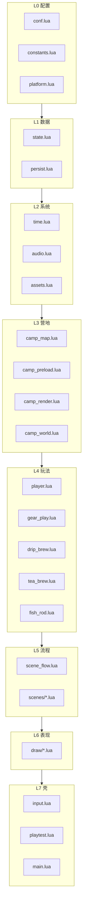

# 露营之旅 — 代码架构 SPEC（模块化）

> 从属：[游戏设计-SPEC.md](./游戏设计-SPEC.md) · [动画与交互-SPEC.md](./动画与交互-SPEC.md)  
> 状态：2026-08-31 · **P0–P6 已落地**（DEV-068a–e）  
> 动机：真机/桌面 `main.lua` 触顶 **Lua 200 locals**；单文件 ~3700 行，玩法迭代风险高。

---

## 1. 问题陈述

### 1.1 触发事件

2026-08-31 在 `main.lua` 增加时间常量时，Love 编译报错：

```text
main function has more than 200 local variables
```

排查结论（桌面 `love game --playtest`）：

| 指标 | 当前值 | 上限 |
|------|--------|------|
| `main.lua` 顶层 `local` 名字 | **~198** | **200** |
| 其中 `local function` | 76 | — |
| 其中变量 / table / 常量 | ~122 | — |
| 顶层 `function`（全局，**不计入**） | 59 | — |
| 文件行数 | ~3700 | — |

Lua 限制来自编译器硬编码（`lparser.c` → `MAXVARS 200`），**每个函数/文件 chunk 独立计数**。整个 `.lua` 文件等价于一个 main chunk，顶层所有 `local` 共享配额。

参考：[Stack Overflow — Lua 200 local limit](https://stackoverflow.com/questions/66511018/lua-how-many-variables-a-local-can-hold)

### 1.2 结构性问题

| 现象 | 影响 |
|------|------|
| 状态散落成 80+ 顶层 scalar | 每加一个字段占 1 名额；难追踪谁改 `scene` |
| 76 个 `local function` 堆在 main chunk | 渲染/音频/流程/时钟耦合在一起 |
| 17 个 forward declare 占名额 | `local updateFish, spawnFishJump, ...` 一行即 7+ local |
| 仪式已模块化，其余仍 monolith | `drip_brew` / `tea_brew` / `fish_rod` 证明路径可行，但未推广 |

### 1.3 已有成功经验（必须复用）

[手冲模块-SPEC.md](./手冲模块-SPEC.md) 已验证的模式：

1. **独立 `require` 文件**，模块内自有 200 配额。  
2. **`Module.bind(host)`** 注入宿主能力，模块不闭包 `main` 的 local。  
3. **`PHASES` 数据驱动**，行为与表分离。  
4. **`main` 只保留**：入口、全局 `ritual` 指针、输入路由、playtest 钩子。

本架构 SPEC 将该模式推广到 **时钟 / 存档 / 音频 / 资源 / 营地 / 场景 / 输入**。

---

## 2. 目标与非目标

### 2.1 目标

1. **`main.lua` 顶层 local ≤ 30**，长期留 **≥ 50** 余量。  
2. **行为零回归**：整局流程、playtest、`verify-3ds-install.py` 全 PASS。  
3. **增量迁移**：每阶段可合并、可发 3dsx，禁止「停更两周大重构」。  
4. **新玩法默认加在模块里**，不再往 `main.lua` 堆 `local function`。  
5. 提供 **`scripts/count-lua-locals.py`**，CI/自测可预警 >180。

### 2.2 非目标

- 不重写 LovePotion 引擎层。  
- 不顺带改玩法数值、美术管线。  
- 不引入 luarocks / 第三方 OOP 框架。  
- 不把 `love.*` 回调拆到多个文件注册（仍只在 `main.lua` 暴露给引擎）。

---

## 3. 设计原则

### 3.1 分层依赖（单向）



**规则**

- 下层 **不得** `require` 上层（例如 `time.lua` 不能 require `draw/play.lua`）。  
- 同层模块通过 **`state.lua` 只读/显式 API** 通信，禁止跨模块写私有 upvalue。  
- 仪式模块（drip/tea/fish）保持 **bind 宿主**，不改为直接读全局 `_G`。

### 3.2 状态：一个权威 `State` 表

避免再增加顶层 scalar。运行时权威状态收进 **单例 table**（模块 `state.lua` 返回）：

```lua
-- state.lua（示意）
local S = {
  scene = "title",
  build = { id = "..." },
  platform = { isConsole = false, staticPlayFx = false },
  trip = { haul = {...}, fruitTrees = {} },
  player = { x = 10, y = 9, facing = 0, castId = 1 },
  time = { dayIndex = 1, clockMin = 540, frozen = false, autoT = 0 },
  camp = { ready = false, map = {}, decals = {} },
  ui = { toast = "", toastT = 0, menuIndex = 1 },
  play = { ritual = nil, lanternOn = false, tentOpen = false },
}
return S
```

访问约定：

| 场景 | 写法 |
|------|------|
| 模块内部 | `local S = require("state")` 然后 `S.time.clockMin` |
| 需重置整趟 | `State.resetTrip()` 等显式函数，不散落赋值 |
| 仪式 bind | host 提供 `getRitual` / `setRitual`，内部读写 `S.play.ritual` |

**注意**：`require("state")` 在 Lua 5.1 下缓存为同一 table，**不要** `return { ... }` 每次 copy。

### 3.3 宿主 `Host`：副作用出口

模块内禁止直接调用未注入的 `love.audio.play`。统一经 **Host**（由 `main.lua` 在 `love.load` 组装）：

| Host 能力 | 提供者 | 典型消费者 |
|-----------|--------|------------|
| `say(msg, sec)` | ui 薄封装 | 全部 |
| `playSfx` / `playBgm` / `syncAmbient` | audio.lua | gear, scenes, rituals |
| `loadImage` / `assetPath` | assets.lua | camp, draw, rituals |
| `appendLoadLog` | platform | assets, preload, playtest |
| `getRitual` / `setRitual` | state + gear_play | drip/tea/fish |

初始化顺序（固定）：

```lua
-- main.lua love.load 示意
local State = require("state")
local Host  = require("host")
Host.init({
  state = State,
  say = function(...) require("ui_toast").say(...) end,
  -- ...
})
require("audio").bindHost(Host)
require("assets").bindHost(Host)
require("time").bindHost(Host)
require("drip_brew").bindHost(Host)  -- 已有
```

### 3.4 全局符号策略

| 符号 | 策略 |
|------|------|
| `love.*` 回调 | **仅** `main.lua` 定义 `function love.load` 等 |
| `Persist.*` | 迁入 `persist.lua`；过渡期可保留 `_G.Persist = require("persist")` 供 playtest 字符串断言 |
| `DripBrew` / `TeaBrew` / `FishRod` | 保持 `require` 挂 `_G` 或 `main` 局部 **1 个**（与现网 playtest 兼容） |
| `drawTop` / `drawBottom` | 迁入 `draw/init.lua`，由 `love.draw` 调用 **1 个** `Draw.frame()` |
| 场景跳转 `goTitle` 等 | 收进 `scene_flow.lua` 导出表，禁止 20 个全局 `function goX` |

### 3.5 局部变量预算

| 模块 | 目标 local 数 | 说明 |
|------|---------------|------|
| `main.lua` | ≤ 30 | 仅 require 别名 + love 回调 |
| 单系统模块 | ≤ 80 | 超过则再拆（如 `camp_render` → `camp_ground` + `camp_props`） |
| 单 draw 文件 | ≤ 60 | 按场景拆文件 |
| 仪式模块 | ≤ 100 | 已达标 |

预警线：**单文件 ≥ 180** 时 pre-commit / playtest 前必须报 WARN。

---

## 4. 模块目录（目标态）

```
game/
  conf.lua                 # Love 启动配置（保持）
  main.lua                 # 引擎壳 ~150 行
  host.lua                 # Host 组装 + bind 注册
  constants.lua            # 分辨率、TILE、时段名、gear 静态表
  platform.lua             # isConsole、feature flags、load log
  state.lua                # 权威运行时 State 单例
  persist.lua              # 存档 JSON（现 Persist 表）
  time.lua                 # 时钟、R 快进、自动 tick、光线档
  audio.lua                # BGM/SFX/环境音
  assets.lua               # 路径探测、loadImage、ensureStory/Cast/Ritual
  ui_toast.lua             # say / drawToast
  camp_map.lua             # buildMap、walkable、tile 工具、fruitTrees
  camp_preload.lua         # campPreload 步进器
  camp_world.lua           # 鱼/鸟/虫/夜星/溅水 update+spawn
  camp_render.lua          # 地面/水/树/玩家/世界 FX 绘制入口
  player.lua               # tryMove、drawPlayerAt
  gear_play.lua            # tryUseGear、帐篷/扇/杯/非仪式装备
  scene_flow.lua           # goTitle/goPlay/... 场景状态机
  input.lua                # keypressed/gamepad/touch 路由
  playtest.lua             # --playtest 状态机
  drip_brew.lua            # 已有
  tea_brew.lua             # 已有
  fish_rod.lua             # 已有
  scenes/
    title.lua              # 菜单逻辑 + 可选 draw 委托
    story.lua              # prologue/depart/homecoming beats
    cast.lua
    codex.lua
    about.lua
    diary.lua
    play.lua               # play 场景 update 切片（非 love.update 全部）
  draw/
    init.lua               # drawTop/drawBottom 分发
    title.lua
    story.lua
    cast.lua
    codex.lua
    about.lua
    diary.lua
    play_top.lua
    play_bottom.lua
    camp_tiles.lua         # drawGround、drawCampGroundLayer
    ritual_overlay.lua
```

**3DS 部署**：上述 `.lua` 与 PNG 一样随 `game/` 进 RomFS；`require` 路径不含 `.lua` 后缀，与现网一致。

---

## 5. 模块职责详表

### 5.1 `main.lua`（引擎壳）

| 职责 | 说明 |
|------|------|
| `love.load` | 调 `Host.init` → `Persist.load` → 字体 → 标题资源 → playtest 探测 |
| `love.update` | 委托 `SceneFlow.update(dt)`、`Time.tickAuto(dt)`、`CampWorld.update(dt)`、`Playtest.tick(dt)` |
| `love.draw` | `Draw.frame(screen)` |
| `love.keypressed` 等 | `Input.onKey(...)` |
| **禁止** | 业务 `if phase ==`、大地图绘制、存档字段拼装 |

### 5.2 `state.lua`

- 持有 §3.2 全部可变字段。  
- 导出：`resetTrip()`、`resetCampSession()`、`snapshotForSave()`。  
- **不**含 love 调用。

### 5.3 `persist.lua`

- 从现 `Persist.*` 原样迁移。  
- 依赖：`state.trip`、`state.saveData`（或 bind 读 host.state）。  
- 文件：`save.json` 路径不变。

### 5.4 `time.lua`

| API | 说明 |
|-----|------|
| `Time.bindHost(h)` | 注入 `say`、`appendLoadLog`、`syncPlayBgm` |
| `Time.label()` | `D1 09:00` |
| `Time.advance(reason)` | wait / auto / manual |
| `Time.fastForward()` | R 键：+10 分，不跨天 |
| `Time.tickAuto(dt)` | play 场景自动走时 |
| `Time.setClock(min, day?)` | playtest / 调试 |
| `Time.tint()` | 返回当前 `timeTint` 行 |
| `Time.isNight()` | 夜星/虫触发 |

**状态归属**：`S.time.*` 全部字段。

### 5.5 `audio.lua`

- 真机策略见 **[真机音频扩展-SPEC.md](./真机音频扩展-SPEC.md)**（DEV-069）：由 `console_single_stream_no_stop` 升级为 `console_prox_amb_bgm_switch`（title/night BGM + 近水溪水 + 近鸟 sfx）。  
- `playSfx` pcall 兼容真机无 `setPitch`。  
- `syncPlayBgm` / `syncAmbient` / **`syncSceneBgm`** 读 scene + `Time.isNight()`；鸟叫冷却建议收进 **`Audio.tick(dt)`**。

### 5.6 `assets.lua`

- `detectAssetRoot`、`mountFullPath`（DEV-048）、失败负缓存。  
- `ensureStory/Cast/Walk/Ritual` 懒加载。  
- `loadImage` → 真机 `.t3x` 逻辑集中在此，不散落 draw。

### 5.7 `camp_*` 三件套

| 文件 | 从 main 迁出 |
|------|----------------|
| `camp_map.lua` | `buildMap`、`walkable`、`tileAt`、`fruitTrees`、`firepit` |
| `camp_preload.lua` | `makeCampPreloadSteps`、`runCampPreloadSlice`、`ensureCamp` |
| `camp_world.lua` | fish/critter/night/splash update+spawn |
| `camp_render.lua` | `drawPlayTop` 编排；调用 `draw/camp_tiles` |

静态底图 `camp_static_base` 策略（DEV-055）不变；渲染模块只读 `State.platform.staticPlayFx`。

### 5.8 `gear_play.lua`

- `gear` 静态表可进 `constants.lua` 或留此文件。  
- `tryUseGear`、`toggleTent`、`drinkFromCup`、杯/壶状态。  
- 仪式入口：**只** `DripBrew.start()` / `TeaBrew.start()` / `FishRod.start()`，不在此写相位 if。

### 5.9 `scene_flow.lua`

- 场景 ID 与 [游戏设计-SPEC §3.0](./游戏设计-SPEC.md) 一致。  
- 导出：`goTitle()`、`goPlay()`、`startJourney()`、`confirmMenu()` …  
- 负责 **场景切换时** 的 BGM/预加载触发，不画像素。

### 5.10 `scenes/*.lua`

每个文件包：**进入条件、advance、输入子集（可选）**。  
例：`scenes/cast.lua` → `Cast.advance()`、`Cast.confirm()`、`Cast.hitTest()`。

### 5.11 `draw/*.lua`

- 纯绘制 + 读 State/assets；**不写** 存档、不改 scene。  
- `draw/init.lua`：

```lua
function Draw.frame(screen)
  if screen == "top" then Draw.routeTop() else Draw.routeBottom() end
end
```

### 5.12 `input.lua`

- 按 `State.scene` 分发；play 场景 ritual 进行时先交给对应 `DripBrew.onKey`（若未来需要）。  
- 桌面 WASD / 3DS gamepad 映射保持 [怎么玩.md](./怎么玩.md)。

### 5.13 `playtest.lua`

- 完整迁出 `playtestTick` 与 41 步状态机。  
- 通过 Host 调场景跳转，**禁止** 依赖 main 私有 local。  
- 继续写 `playtest/outDir/result.txt` → `PASS`。

---

## 6. 仪式模块与架构的关系

现有三模块 **不改对外 API**，仅改 bind 来源：

```lua
-- gear_play.lua
DripBrew.bindHost({
  say = Host.say,
  getRitual = function() return State.play.ritual end,
  setRitual = function(r) State.play.ritual = r end,
  -- ...
})
```

新增仪式（例：未来「搭帐篷仪式」）流程：

1. 写 `docs/xxx模块-SPEC.md`  
2. 新建 `game/xxx.lua` + `bindHost`  
3. 在 `gear_play.tryUseGear` 加 **1 个** 分支调用 `Xxx.start()`  
4. **禁止** 在 `main.lua` 加 local

---

## 7. 迁移计划（增量）

每阶段：**迁模块 → playtest PASS → audit locals → deploy 可选**。

| 阶段 | 内容 | 预估释放 main locals | 风险 |
|------|------|----------------------|------|
| **P0** | `scripts/count-lua-locals.py`；文档入 SPEC | 0 | 低 |
| **P1** | `persist.lua` + `time.lua` + `state.lua`（时间+存档字段） | ~25 | 低 |
| **P2** | `ui_toast.lua` + `audio.lua` | ~20 | 低 |
| **P3** | `playtest.lua` | ~15 | 中（步骤多） |
| **P4** | `assets.lua` + `camp_preload.lua` | ~25 | 中（真机路径） |
| **P5** | `camp_map.lua` + `camp_world.lua` | ~30 | 中 |
| **P6** | `draw/camp_*` + `camp_render.lua` | ~40 | 高（绘制回归） |
| **P7** | `scenes/*` + `scene_flow.lua` | ~25 | 中 |
| **P8** | `draw/*` 余下 + `input.lua`；main 收到 ~150 行 | ~20 | 中 |

**禁止**：跨阶段合并未验收的 PR；P6 与 P7 不可并行（draw 依赖 scene 路由稳定）。

### 7.1 P1 验收标准（样板阶段）

- `scripts/count-lua-locals.py game/main.lua` → **≤ 175**  
- `love game --playtest` → PASS  
- R 键仍为当天 +10 分（DEV-052 修订行为）  
- 真机 `load_report.txt` 无新 ERROR  

---

## 8. 工具与门禁

### 8.1 `scripts/count-lua-locals.py`

- 统计规则：与 Lua 5.1 一致，**顶层 chunk 的 local 名字总数**（含 `local function`）。  
- 输出：`OK` / `WARN`（≥180）/ `FAIL`（≥200）。  
- 接入：`love game --playtest` 前可选调用；`verify-3ds-install.py` 可增加 WARN 行。

### 8.2 模块新增 checklist

- [ ] 单文件 locals < 180  
- [ ] 不新增 main 顶层 local（除非 main 同时删等量）  
- [ ] 副作用走 Host  
- [ ] 状态写 State 子表  
- [ ] 更新本 SPEC 或子模块 SPEC  
- [ ] playtest 覆盖新路径或注明 N/A  

---

## 9. 测试策略

| 层级 | 命令 | 期望 |
|------|------|------|
| 桌面全流程 | `love game --playtest` | `PASS` |
| 静态营地 | `LINJIAN_PLAY_FX=static love game --playtest` | PASS |
| 局部变量 | `python3 scripts/count-lua-locals.py game/main.lua` | ≤175（P1 后） |
| 像素 | `scripts/audit-pixel-style.py` | 0 fail |
| 真机 | `scripts/verify-3ds-install.py` + 短玩 | 无 abort |

**不建议** 为每个模块引入独立 unit test 框架（Love 上过重）；`playtest` + 局部计数足够。

---

## 10. 反模式（禁止）

| 反模式 | 原因 | 替代 |
|--------|------|------|
| 去掉 `local` 变全局凑名额 | 污染、难测、真机偶发 nil | 拆文件 |
| `do ... end` 包一层以为能减 200 | Lua 5.1 同函数寄存器池仍共享 | 拆文件 |
| 模块间 `require` 循环 | 启动顺序不确定 | 依赖 state/host，单向 |
| 在 draw 里 `Persist.write()` | 绘制路径卡顿、难复现 | scene_flow / diary 场景 |
| 复制粘贴 forward declare 行 | 占 7+ local | 同文件内 local function 或 module table |
| 新功能直接写 main | 再次触顶 | 新模块 + SPEC |

---

## 11. 与现有文档关系

| 文档 | 关系 |
|------|------|
| [游戏设计-SPEC.md](./游戏设计-SPEC.md) | 玩法权威；架构 **不得** 改流程定义 |
| [手冲/泡茶/钓鱼模块-SPEC](./手冲模块-SPEC.md) | 仪式模块样板；bind 契约延续 |
| [动画与交互-SPEC.md](./动画与交互-SPEC.md) | draw 模块须遵守精灵/仪式绘制约定 |
| [怎么玩.md](./怎么玩.md) | 输入映射；`input.lua` 保持一致 |
| Skill `linjian-camping-3ds` | 迁移后更新「资源位置 / 自测」节 |

---

## 12. DEV 追踪

| ID | 日期 | 状态 | 摘要 |
|----|------|------|------|
| **DEV-068** | 2026-08-31 | **in progress** | **代码架构 SPEC**：main.lua 198/200 locals；模块化分层 + State/Host；迁移 P0–P8 |
| **DEV-068a** | 2026-08-31 | done | P0：`count-lua-locals.py` |
| **DEV-068b** | 2026-08-31 | done | P1：`state` + `time` + `persist`；main 173 locals |
| **DEV-068c** | 2026-08-31 | done | P2：`ui_toast.lua` + `audio.lua`（bindHost） |
| **P1–P3 接线** | 2026-08-31 | done | `state/persist/time/ui_toast/playtest` 接入 main；102 locals |
| **DEV-068e** | 2026-08-31 | done | P4–P6：`assets` + `camp_preload` + `camp_map` + `camp_world` + `draw/camp_tiles` + `camp_render`；main **115** locals；playtest PASS |
| DEV-069 | — | wip | 真机 title/night BGM + 近水溪 + 近鸟 sfx（单独立 SPEC） |
| DEV-068f | — | planned | P7–P8：scenes + input；main ≤150 行 |

---

## 13. 开放问题（实施前可拍板）

1. **`State` 是否允许模块直接写字段？**  
   - 建议：允许读；写通过小函数 `State.setScene(id)` 便于断点/log。  
2. **`gear` 表放 `constants.lua` 还是 `gear_play.lua`？**  
   - 建议：静态放 constants，交互放 gear_play。  
3. **draw 是否再拆 `draw/play_top.lua` 为 top + hud？**  
   - 视 P6 后 local 计数而定，非必须。  
4. **是否引入轻量 `events.emit("dawn")`？**  
   - 非 P1 范围；时钟侧效应现保持 `say` + `canGoHome` 即可。

---

*文档版本：2026-08-31 · 与 buildId `2026-08-31-tea-brew` 对齐*
