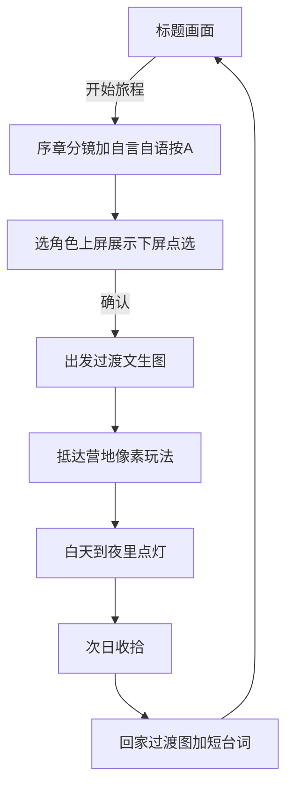

# 露营之旅 — 游戏设计 SPEC

> 状态：设计定稿中（2026-08-30）  
> 平台：Nintendo 3DS Homebrew（LovePotion / LÖVE）  
> 类型：休闲 · 一日露营模拟 · 爱好向（不上架）

正式中文名：**露营之旅**  
曾用名 / 工程名：`linjian`（林间一夜）— 仓库目录可暂保留，对玩家展示统一用「露营之旅」。

---

## 1. 体验一句话

一个夏天上班族，周末逃离城市，带着咖啡器具与露营装备来到有小河的林间；从清晨玩到夜里，点起露营灯过夜，第二天收拾行李回家——**下一周周末再来**，装备与小目标略有不同。

偏 **慢节奏休闲**：不拼操作、不战斗，重点是人物、咖啡道具、帐篷与光线氛围。

---

## 2. 3DS 双屏与「首页」约定

典型 3DS 自制/正版流程：

1. **标题画面（Title）** ← 进入游戏后的第一屏  
2. 主菜单（开始 / 继续 / 图鉴等）  
3. 游戏本体（上屏世界 + 下屏 UI）

### 2.1 标题画面（必做）

| 屏 | 内容 |
|----|------|
| **上屏 400×240** | 漂亮的林间/河岸背景图（可有轻微视差或光影呼吸）；大标题「露营之旅」；小副标如「Weekend Escape」或「夏天 · 林间」 |
| **下屏 320×240** | 菜单：`开始旅程` / `继续`（有存档时） / `装备图鉴` / `关于`；触摸或十字键选择，A 确认 |

参考氛围：午后金光透过树叶、河面反光、角落一角帐篷剪影——**先卖情绪，再进玩法**。

标题页可循环短 BGM（可选，后期）。

### 2.2 游戏中双屏分工

| 屏 | 职责 |
|----|------|
| 上屏 | 俯视 2.5D 像素营地（类三角力量透视感，非林克）：走路、互动、时间光线 |
| 下屏 | 背包 / 当前动作 / 简短提示；触摸选装备、点「点火」「手冲」等 |

---

## 3. 叙事与循环结构

### 3.0 整局流程图（已拍板 · 2026-08-30）

玩家可见完整一局 = **标题 → 序章分镜对话 → 选角色 → 出发过渡 → 营地玩法 → 回家过渡 → 标题**。



| 序号 | 场景 ID | 内容 | 上屏 | 下屏 |
|------|---------|------|------|------|
| 1 | `title` | 标题菜单 | 标题风景 + 游戏名 | 开始 / 继续 / 图鉴 / 关于 |
| 2 | `prologue` | **故事序章** | 文生图分镜（一张一张） | 「A 继续」或台词框；按 A / 触摸下一句 |
| 3 | `cast` | **选角色** | 当前角色大立绘/像素放大 + 短介绍 | 角色列表点选；确认键 |
| 4 | `depart` | **出发过渡** | 文生图 2 张左右（出门→林道） | 可自动或按 A |
| 5 | `play` | 营地本体 | 俯视像素林间 | 背包 / 互动 |
| 6 | `homecoming` | **回家过渡** | 文生图 1～2 张 + 短结算句 | 按 A 回标题 |

### 3.0.1 序章对话稿（初稿，可改）

分镜与台词一一对应；**按 A** 前进（真机 A / 触摸下屏）。

| 镜号 | 图资产（建议） | 台词（自言自语） |
|------|----------------|------------------|
| P1 | `story_p1_weekend.png` | 「……终于周末了。」 |
| P2 | `story_p2_pack.png` | 「电脑关上。咖啡器具、帐篷……都带上。」 |
| P3 | `story_p3_door.png` | 「去有小河的那片林子吧。」 |
| P4 | （可复用 P3 或淡出） | 「走。」→ 进入选人 |

### 3.0.2 选角色

- 使用 `docs/characters/summer_v2_*` 角色池（约 9 人）。  
- **先序章、后选人**（已拍板）：故事立住「周末要出发」的情绪，再选「这次谁去」。  
- 下屏点选，上屏预览；确认后进入出发过渡。

### 3.0.3 文生图分镜规范

- 用途：序章 / 出发 / 回家的**情绪过场**，不是营地玩法贴图。  
- 画幅：按 3DS 上屏约 **400×240（≈5:3）** 构图。  
- **风格锚点（已拍板 · DEV-036）**：运行时全是 **16-bit 硬像素**。题材可参考 `docs/storyboards/style_ref_desired.jpg` / `docs/mockups/`，**禁止把写实厚涂原样进游戏**。  
  - 要：限色（全屏 ≤64 色）、大色块、nearest、一眼能认。  
  - 不要：照片、体积光油画、高斯模糊、抗锯齿脏边。  
  - 管线：构图可文生 → cover 到 400×240 → **可 200×120 再 ×2 nearest** → median-cut 32–48 色 → `scripts/audit-pixel-style.py` 通过才进 `game/assets/story/`。  
  - Skill：`.cursor/skills/linjian-pixel-style/`。

### 3.1 营地内一日流程（play 段）


| 阶段 | 时间感 | 玩家在做什么 |
|------|--------|--------------|
| 抵达林间 | 清晨～上午 | 走到空地，展开帐篷 |
| 白天活动 | 上午～下午 | 手冲、河边、可选钓鱼 |
| 黄昏 | 傍晚 | 小锅、收束 |
| 夜晚 | 夜里 | **点亮露营灯** |
| 次日清晨 | 早晨 | 起床短演出 |
| 收拾回家 | — | 收帐篷 → 进入 `homecoming` |

### 3.2 多周末循环（meta）

- 每结束一局 = 「又过了一个周末」。
- **下一局装备略有差异**（休闲重复可玩性）：
  - 咖啡豆：浅烘 / 深烘 / 果香水洗 等（影响手冲文案与杯面颜色）
  - 本周末小目标：想钓鱼、想多喝两杯、想早点点灯看星星
  - 可选：背包多一件小道具（扇子、折叠椅等）
- 不做硬核资源管理；失败条件尽量无（最多「灯没点就睡」给温柔吐槽）。

---

## 4. 核心玩法支柱

1. **移动探索**：十字键在林间空地 / 河岸走动（范围小而精，不开放大地图）。  
2. **装备互动**：下屏选中装备 → 上屏对目标点 A 使用（搭帐篷、手冲、点灯…）。  
3. **时间推进**：一天内时段变化（见下）；关键行动或「发呆/等待」推进时间。  
4. **仪式节点**：搭帐篷、手冲一杯、**夜里点露营灯**、次日收摊回家。

非目标：战斗、复杂 RPG 数值、多结局压力。

---

## 5. 时间与光线

上屏 HUD 显示时段（文字 + 小图标即可），例如：

`清晨 → 上午 → 午后 → 黄昏 → 入夜 → 深夜 → 黎明`

| 时段 | 光线倾向 | 备注 |
|------|----------|------|
| 清晨 | 冷蓝雾、长影 | 抵达 / 次日起床 |
| 上午 | 清亮绿 | 搭帐篷、散步 |
| 午后 | 暖黄 | 手冲、河边 |
| 黄昏 | 橙粉 | 收束白天 |
| 入夜 | 深蓝紫 | **可点露营灯** |
| 深夜 | 更暗 + 灯晕 | 休息 |
| 黎明 | 渐亮 | 收拾 |

实现建议（技术）：全局色调叠加（multiply / 半透明色层）+ 灯具局部亮斑；不必真动态全局光。

---

## 6. 角色与美术重点（优先打磨）

### 6.0 完成度目标（已拍板）

- **不对标抄袭**三角力量（A Link to the Past）的具体素材/角色，但**细节与丰富度**要对齐那个量级：地砖有层次、物件不「复读同一棵树」、角色与道具有轮廓光/内阴影/小饰品。  
- **当前画面**（营地色块→早期像素）属于 **功能原型 / 灰盒可玩**，离目标还差一整条美术管线，属正常阶段。  
- 推荐工具：**不强制 Aseprite**（收费）。本项目默认由 Agent 用脚本直接产出 PNG 像素资源进 `game/assets/`，电脑 `love game` 预览即可。若你愿手绘，任意免费工具（LibreSprite / Piskel / Photopea）均可。  
- **资源要先在电脑设计好**再进 `game/assets/`；不要指望在真机上边玩边捏像素。真机只做最终观感验收。  
- 丰富度清单（验收用，非一次做完）：
  1. **Tileset**：草地至少 4～8 变体 + 河岸转角/直边套件 + 浅滩；树 2～3 冠型、可叠层。  
  2. **道具**：帐篷分部件（布面褶皱、门帘、地钉）；手冲分 V60/分享壶/粉层；杯子有液面高光。  
  3. **角色**：四向（或至少左右）走帧；服装缝线、背包扣、鞋底泥点等「闲笔」。  
  4. **场景点缀**：野花、落叶、河面碎光动画 2～3 帧、营火/灯晕。  
  5. **下屏 UI**：羊皮纸纹理、选中框 9-slice、图标独立绘制而非占位块。  
- 制作顺序建议：先 **tileset + 河岸**（一眼变丰富）→ **帐篷/咖啡道具** → **角色动画** → 标题大图精修。  
- 参考：`docs/mockups/` 定情绪；`docs/characters/summer_v2_*` 定人物方向；玩法参考三角力量的是 **透视与信息密度**，题材仍是现代露营。

### 6.1 人物

- 主角：夏天上班族露营造型（现有 summer_v2 角色池可继续用）。  
- **细节优先**：眼镜反光、背包带、袖口卷起、草帽檐、鞋底泥点等。  
- 支持多角色外观（图鉴可选），玩法共用。  
- 四向走（或至少左右翻面 + 前后帧）后期补。  
- **已落地（DEV-023）**：见 [动画与交互-SPEC.md](./动画与交互-SPEC.md)；`c{N}_walk.png` 四向×3 帧；手冲三步仪式；帐篷地图开合。

### 6.2 咖啡道具（招牌细节）

- 手冲壶 / V60 / 分享壶 / 杯子分层绘制。  
- 不同豆子 → 粉层色、汤色、品鉴短句不同。  
- 手冲流程可做成 2～4 步小交互（闷蒸 → 绕圈注水 → 分享），不做成模拟器地狱。

### 6.3 帐篷

- 搭起 / 收起两态；夜灯模式下帐内透光。  
- 门帘、防风绳、地钉等像素点缀。

### 6.4 场景

- 林间空地 + **小河**（右岸或穿场）。  
- 标题背景：可单独高完成度插画/像素大图（400×240 + 下屏呼应）。  
- 参考：`docs/mockups/` 午后等概念图；运行时像素风对齐 `docs/characters/summer_v2_*`。

---

## 7. 界面与存档（摘要）

- **标题菜单**：开始 / 继续 / 图鉴 / 关于。  
- **下屏背包**：本周末携带清单；选中高亮；短说明。  
- **存档**：一档即可（周末序号、装备变体、是否完成点灯）。放 LovePotion `identity` 目录。

---

## 8. 分阶段交付（建议）

| 阶段 | 内容 | 验收 | 状态 |
|------|------|------|------|
| **P0** | 标题画面 + 开始进入现有营地原型；中文 UI | 电脑 `love game` / 真机可进标题再进营地 | **已接入标题页（2026-08-30）** |
| **P1** | 时段切换 + 光线罩；HUD 时间 | 可从午后推到入夜 | 待做 |
| **P2** | 搭帐篷 / 手冲 / **点露营灯** 三件互动 | 夜里点灯有明显反馈 | 待做 |
| **P3** | 次日收拾 → 回城短过场 → 回标题；周末循环 + 豆子变体 | 完整一局闭环 | 待做 |
| **P4** | 角色/咖啡/帐篷细节美术；标题精美背景；可选 BGM | 观感达到「愿意发给朋友」 | 待做 |

下一优先：**P1 时段与光线**。

---

## 9. 技术约束（提醒）

- 引擎：LovePotion 3.0.2；预览：桌面 LÖVE 11。  
- 中文：真机 `chinese` 系统字体；桌面 `game/fonts/zh-ui.ttf`（新增文案需扩展子集字形）。  
- 部署：`.3dsx` + `game/`；暂不打 CIA。  
- 细节见 [项目背景.md](../项目背景.md)。

---

## 10. 开放决策（已拍板）

| 项 | 决定 |
|----|------|
| 玩家可见名称 | **露营之旅** |
| 第一屏 | **标题画面**（上图下文菜单） |
| 核心仪式 | 搭帐篷、手冲、夜里点灯、次日回家 |
| 重复可玩 | 周末循环 + 装备/豆子小差异 |
| 调性 | 休闲、夏天、上班族减压，不虐 |
| 音乐 | **精简为 3 首 BGM**（标题 / 白天营地 / 夜里）+ **游戏音效（SFX）**；见 §11。黄昏/回城等轨不做。 |

---

## 11. 音频设计（精简版）

### 11.1 结论（2026-08-30 拍板）

**不需要 8 首 BGM。** 小品体量够用的是：

| 类型 | ID | 文件 | 状态 | 何时播 |
|------|-----|------|------|--------|
| BGM | **01 标题** | `audio/bgm_01_title.mp3` | ✅ 已接入 | 标题画面循环 |
| BGM | **02 白天** | `audio/bgm_02_morning.mp3` | ✅ 已接入 | 「开始旅程」后营地白天循环（清晨～黄昏可共用这一首） |
| BGM | **03 夜里** | `audio/bgm_03_night.mp3` | ✅ 已接入（《夜营灯光》） | 入夜 / 深夜循环；黎明切回白天曲 |
| SFX | 见下表 | `audio/sfx_*.wav` | ✅ 清单齐 | UI / 脚步 / 帐篷 / 手冲 / 杯子 / 扇子 / 点灯 |
| 环境音 | 鸟 / 虫 / 溪 | `audio/amb_*.mp3` | ✅ 营地循环垫底 | 白天鸟鸣 · 夜里虫鸣 · 溪水常垫 |

原先草案里的黄昏 / 回城 / 手冲专用 BGM / 次日曲 **全部取消**；氛围靠 **换 BGM + SFX + 光线** 即可。

**BGM vs 音效：**

- **BGM**：长时间垫在底下的情绪床（少、能 loop）。  
- **SFX**：玩家一操作就响一声的反馈——露营小品里 **SFX 往往比多几首 BGM 更「像游戏」**。优先做 SFX。

### 11.2 夜里 BGM · 已完成

成品：`game/audio/bgm_03_night.mp3`（《夜营灯光》）。玩法中 `X` 推进到「入夜/深夜」时自动切换；「黎明」切回白天曲。
### 11.3 音效清单（SFX · 优先于再搓 BGM）

| ID | 触发 | 听感参考 | 来源建议 |
|----|------|----------|----------|
| `sfx_ui_ok` | 菜单确认 / 分镜翻页 / 选角确认 | 按钮 click | ✅ `sfx_ui_ok.wav`（Freesound original_sound UI clicks，裁短） |
| `sfx_ui_move` | 菜单上下移 / 选角移动 / 选背包格 | 软 menu tick | ✅ `sfx_ui_move.wav`（Freesound morganpurkis menu-selection） |
| `sfx_step` | 走一格 | 草鞋 / 软土（可 2～3 变体轮换） | ✅ `sfx_step.wav`（Freesound giocosound footstep_grass_5） |
| `sfx_tent` | 搭/收帐篷 | 布面抖开、拉链轻响 | ✅ `sfx_tent.wav`（Freesound kevinkace canvas-tent-4） |
| `sfx_pour` | 手冲注水 | 细水流进滤杯 | ✅ `sfx_pour.wav`（Freesound mullnet pouring_water） |
| `sfx_cup` | 端杯 / 喝一小口反馈 | 瓷杯轻碰 | ✅ `sfx_cup.wav`（Freesound that_finn light-ceramic-cling） |
| `sfx_lantern` | **点亮露营灯** | 咔嗒 + 极短暖嗡（仪式感） | ✅ `sfx_lantern.wav`（Freesound tbrook switch-light-06） |
| `sfx_fan` | 扇一下（可选） | 短风声 | ✅ `sfx_fan.wav`（Freesound liferecorded_archive ceiling-fan，裁短淡出） |

### 11.3b 环境氛围音（ambience · 营地垫底）

长素材已裁成 **24～30 秒** 循环 MP3（mono / 22.05kHz / 64kbps），只在 `play` 与 BGM 叠播、音量更低：

| ID | 文件 | 何时 | 来源 |
|----|------|------|------|
| `amb_birds` | `audio/amb_birds.mp3` | 营地白天（清晨～黄昏、黎明） | guillermo_de_la_matera 鸟鸣林 |
| `amb_crickets` | `audio/amb_crickets.mp3` | 入夜 / 深夜 | felixblume 夜虫 |
| `amb_creek` | `audio/amb_creek.mp3` | 营地全程垫溪水 | robertcrosley 小溪 |

SFX **不必用 Suno**（不擅长短反馈音）。放入 `game/audio/`，P2 互动时挂上。

#### 免费音效网站（推荐）

下载前看每条的 **License**（CC0 最省事；CC-BY 需署名，可在游戏「关于」里写）。

| 网站 | 说明 |
|------|------|
| [Freesound](https://freesound.org/) | 最大社区库；搜 `footsteps grass` / `fabric` / `water pour` / `click soft`；筛 **CC0** |
| [Kenney.nl](https://kenney.nl/assets?q=audio) | 游戏向打包音效，多为 CC0，UI/点击类很全 |
| [OpenGameArt](https://opengameart.org/) | 游戏素材站，音效分类多，注意许可证标签 |
| [Sonniss GDC](https://sonniss.com/gameaudiogdc/) | 每年 GDC 免费大包（体量大，偶尔有环境/道具声） |
| [Pixabay Sound Effects](https://pixabay.com/sound-effects/) | 注册后可下，商用友好（看站内条款） |
| [Mixkit](https://mixkit.co/free-sound-effects/) | 免费音效，条款相对宽松 |
| [BBC Sound Effects](https://sound-effects.bbcrewind.co.uk/) | 海量环境声；**个人/教育等用途受限**，商用要另看条款——爱好向自用一般可查 |

本游戏实用搜索词（英文）：`soft ui click`、`footstep grass`、`tent fabric`、`zipper short`、`water pour cup`、`ceramic tap`、`lantern switch` / `light switch soft`、`whoosh short`。

裁短到 **0.1～0.5 秒**（点灯可稍长），导出 **WAV 或短 MP3**，命名与上表 ID 一致。
### 11.4 旧 8 轨草案

已废弃，不再要求制作。历史提示词若需可查 git；以本精简表为准。

---

## 12. 开发日志（时间顺序 · 标准编号）

> 规则：主线动作用 **`DEV-XXX`** 递增编号；同日多条按实际顺序。后续 Agent **先读最新编号**，再改代码。  
> 状态：`done` / `wip` / `planned`

| 编号 | 日期 | 状态 | 动作摘要 |
|------|------|------|----------|
| **DEV-001** | 2026-08-30 | done | 建立 LovePotion 营地原型（`game/main.lua` 色块地图 + 下屏背包） |
| **DEV-002** | 2026-08-30 | done | 拷贝至 SD `3ds/linjian/`；澄清跑 `.3dsx` 非 FBI/CIA |
| **DEV-003** | 2026-08-30 | done | 真机 HB「无法运行」→ 升级 Luma 13.4 + hbmenu；备份 `_backup_boot_2019` |
| **DEV-004** | 2026-08-30 | done | 修复 `dspfirm.cdc not found`（Dump DSP） |
| **DEV-005** | 2026-08-30 | done | 真机首次跑通原型画面 |
| **DEV-006** | 2026-08-30 | done | 持久化 `项目背景.md` + README 索引 |
| **DEV-007** | 2026-08-30 | done | 桌面 LÖVE 预览；中文字体 `zh-ui.ttf`；像素 assets 接入 |
| **DEV-008** | 2026-08-30 | done | 美术迭代（树深度、岸边、背包图标等） |
| **DEV-009** | 2026-08-30 | done | 定名 **露营之旅**；撰写本 SPEC（完整体验） |
| **DEV-010** | 2026-08-30 | done | **P0** 标题画面（`title_top`/`title_bot` + 菜单 → 营地） |
| **DEV-011** | 2026-08-30 | done | 本 SPEC 写入 **Suno BGM 提示词**（§11）与开发日志制度（§12） |
| **DEV-011b** | 2026-08-30 | done | 明确美术目标：细节丰富度对标三角力量量级（不抄素材）；资源须本地设计后预览再上机（§6.0） |
| **DEV-017** | 2026-08-30 | done | **美术管线落地（无 Aseprite）**：8 草地、4 水动画、河岸套件、3 树、2 石、细化帐篷/道具/角色；邻接岸线绘制 + 水面相位；`love game` 预览 |
| **DEV-018** | 2026-08-30 | done | **自测流程**：`love game --playtest`；文档 `docs/怎么玩.md`；约定此后每次优化必跑 |
| **DEV-015a** | 2026-08-30 | done | 接入标题 BGM：`bgm_01_title.mp3`（《River Camp Echoes》） |
| **DEV-015b** | 2026-08-30 | done | 接入白天 BGM：`bgm_02_morning.mp3`（《Dawn Creek Camp》） |
| **DEV-015c** | 2026-08-30 | done | **音频精简**：只需再做夜里 1 首 BGM + SFX（§11 重写）；取消多轨草案 |
| **DEV-015d** | 2026-08-30 | done | 接入夜里 BGM：`bgm_03_night.mp3`（《夜营灯光》）；入夜/深夜自动切换，黎明回白天曲 |
| **DEV-015e** | 2026-08-30 | done | 接入 UI SFX：`sfx_ui_ok` / `sfx_ui_move`（morganpurkis menu-selection）；标题菜单、选角、分镜确认、选背包格 |
| **DEV-015f** | 2026-08-30 | done | `sfx_ui_ok` 换为按钮 click（original_sound UI clicks）；`sfx_ui_move` 仍用 menu-selection |
| **DEV-015g** | 2026-08-30 | done | 接入 `sfx_cup`（that_finn ceramic cling）；手冲入杯/第一口、杯子道具 |
| **DEV-015h** | 2026-08-30 | done | 接入 `sfx_fan`（ceiling-fan 裁短淡出）；扇风仪式开始与第 3 步 |
| **DEV-015i** | 2026-08-30 | done | **SFX 自检**：发现 `sfx_fan` 曾导出为静音并修复；削波 UI/灯轻微压峰；清单 8 条均已加载且有触发 |
| **DEV-015j** | 2026-08-30 | done | 营地环境音：`amb_birds` / `amb_crickets` / `amb_creek`（长素材裁 24～30s 循环）；白天鸟·夜里虫·溪水常垫 |
| **DEV-019** | 2026-08-30 | done | 整局流程 §3.0；分镜风格：题材参考 `style_ref_desired.jpg`，**最终过场用强降采样旧屏版 `*_3ds.png`**（更糊、限色、大色块） |
| **DEV-020** | 2026-08-30 | done | **完整周末环落地**：`prologue`→`cast`→`depart`→`play`→`homecoming`→标题；旧屏分镜 `assets/story/`；九人角色 `assets/cast/`；营地时段/光线罩/点灯/回家；playtest 全流程 PASS |
| **DEV-021** | 2026-08-30 | done | 分镜可读修复：去掉强降采样+强模糊；改为 400×240 轻像素管线，重新导出 `assets/story/` |
| **DEV-022** | 2026-08-30 | done | 九人角色像素重做：成块色块+清噪；`assets/cast/c1–c9`；选人/营地整数倍 nearest 缩放 |
| **DEV-023** | 2026-08-30 | done | **细节层**：四向行走表；帐篷开合；手冲三步仪式+地图蒸汽；`docs/动画与交互-SPEC.md`；Skill `linjian-camping-3ds`；playtest 扩展 PASS |
| **DEV-024** | 2026-08-30 | done | **发版脚本**：`scripts/deploy-to-sd.sh` 同步 SD 并自动打 `linjian.cia`（FBI）；`build-cia.sh` / `ensure-cia-tools.sh` |
| **DEV-025** | 2026-08-30 | done | **营地美化**：蜿蜒可趟小溪、8 种树/灌木/花/芦苇、浅滩、偶尔小鱼跃出；清像素贴图替换 |
| **DEV-026** | 2026-08-30 | done | **细节精修**：九人真四向走帧；手冲三步细像素特写；钓鱼/扇子 4 帧短动画仪式；playtest PASS |
| **DEV-027** | 2026-08-30 | done | **标题首图重做**：上屏林间营地细像素风景；下屏羊皮纸菜单底；旧版备份 `title_*_v1.png` |
| **DEV-028** | 2026-08-30 | done | **营地对标效果图**：统一草地亮度去棋盘；分层树冠+落影；河岸转角；水格同相位；帐篷/营火/树桩重切；`scripts/build-camp-tiles.py` |
| **DEV-029** | 2026-08-30 | done | **对标复盘再修**：泥地空场、溪靠右+踏脚石+码头、树影偏右下、静水波、背包藤框羊皮纸；补字体「包」 |
| **DEV-030** | 2026-08-30 | done | **分镜字幕**：台词与「按 A 继续」不再叠框，并入同一底栏 |
| **DEV-031** | 2026-08-30 | done | **装备图鉴落地**：六件装备上屏说明 + 下屏点选翻页；B 返回；playtest `09_codex` |
| **DEV-032** | 2026-08-30 | done | **关于页**：上屏作品说明 + 下屏周末要点；B 返回；playtest `10_about` |
| **DEV-033** | 2026-08-30 | done | **营地生趣**：鱼跃更勤；三种鸟栖枝/落地/飞回；部分树有巢；蝶、蜻蜓、夜里萤火虫 |
| **DEV-034** | 2026-08-30 | done | **手冲特写改像素**：三步改为 16-bit 大色块，×2 nearest，与营地/钓鱼扇子一致 |
| **DEV-035** | 2026-08-30 | done | **夜晚氛围**：色罩后画硬像素星星/十字亮星、偶发流星拖尾、萤火虫亮点；树冠随风轻晃；落叶粒子；入夜提示「抬头有星星」 |
| **DEV-036** | 2026-08-30 | done | **全局像素闸门**：扫描运行时素材；标题油画改 16-bit；草地/花/营火/手冲图标硬像素重绘；分镜限色；skill `linjian-pixel-style` + `scripts/audit-pixel-style.py` |
| **DEV-012** | — | planned | **P1** 加深：更多时段事件（搭帐篷动画、手冲小游戏） |
| **DEV-014** | — | planned | **P3** 精修回家：次日收拾动画、周末计数 |
| **DEV-015** | 2026-08-30 | done | 基础 SFX 清单齐：UI + 脚步/帐篷/手冲/杯子/扇子/点灯 |
| **DEV-016** | — | planned | **P4** 继续加深美术：更多地砖转角、角色四向帧、道具动画（脚本出图，不强制付费软件） |

### 12.2 Agent 验收约定

每次改玩法/美术/UI 后必须执行：

```bash
cd /Users/ruska/projects/3ds/linjian && love game --playtest
```

日志出现 `PASS`，且 `~/Library/Application Support/LOVE/linjian/playtest/` 有截图，才算本轮完成。
